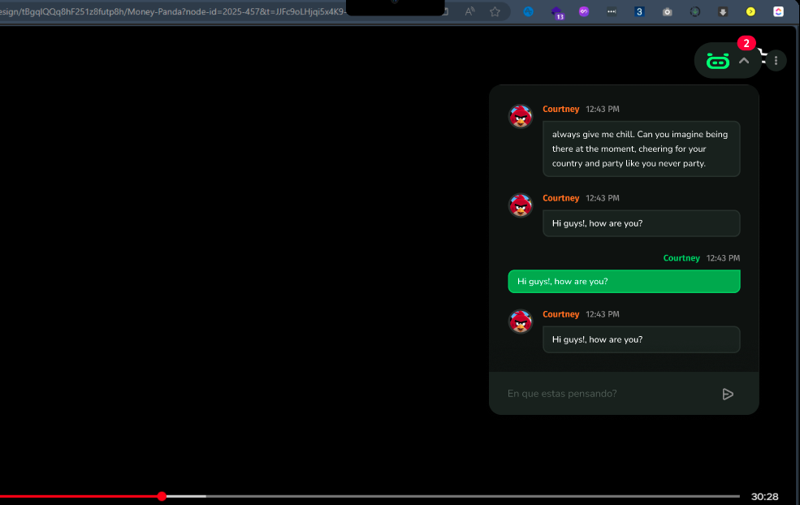

# PiggyChat API

API backend para una extensión de navegador que permite crear salas de chat y conversar en tiempo real mientras ves series en Netflix.

## ¿Qué es PiggyChat?

PiggyChat es una experiencia social integrada en Netflix. Cuando entras a ver un episodio de tu serie favorita, la extensión te permite:
- Crear salas de chat vinculadas a ese contenido específico
- Invitar a otros usuarios a conversar sobre lo que está pasando en pantalla
- Interactuar con otros espectadores en tiempo real

## Stack Tecnológico

- **Framework**: Rails 7.2
- **Base de datos**: PostgreSQL
- **Real-time**: Action Cable (WebSockets)
- **Autenticación**: JWT
- **API style**: REST

## Modelos Principales

- **User**: Usuarios con autenticación JWT, avatar y credenciales
- **Channel**: Salas de chat vinculadas a un sitio web y ubicación específica en el video
- **Message**: Mensajes enviados dentro de una sala
- **MessageInteraction**: Reacciones e interacciones con mensajes

## Endpoints Principales

### Autenticación
```
POST /api/users/signup      - Registrar nuevo usuario
POST /api/users/login       - Iniciar sesión
```

### Canales (Salas)
```
GET    /api/channels           - Listar salas
POST   /api/channels           - Crear nueva sala
GET    /api/channels/:id       - Ver detalles de una sala
GET    /api/channels/:id/messages     - Obtener mensajes
POST   /api/channels/:id/messages     - Enviar mensaje
PUT    /api/channels/:id/messages     - Actualizar mensaje
```

## Instalación

```bash
# Instalar dependencias
bundle install

# Configurar base de datos
rails db:create
rails db:migrate

# Iniciar servidor
rails s
```

## Requisitos

- Ruby 3.x
- PostgreSQL 12+
- Bundler

---

## UI del Proyecto




